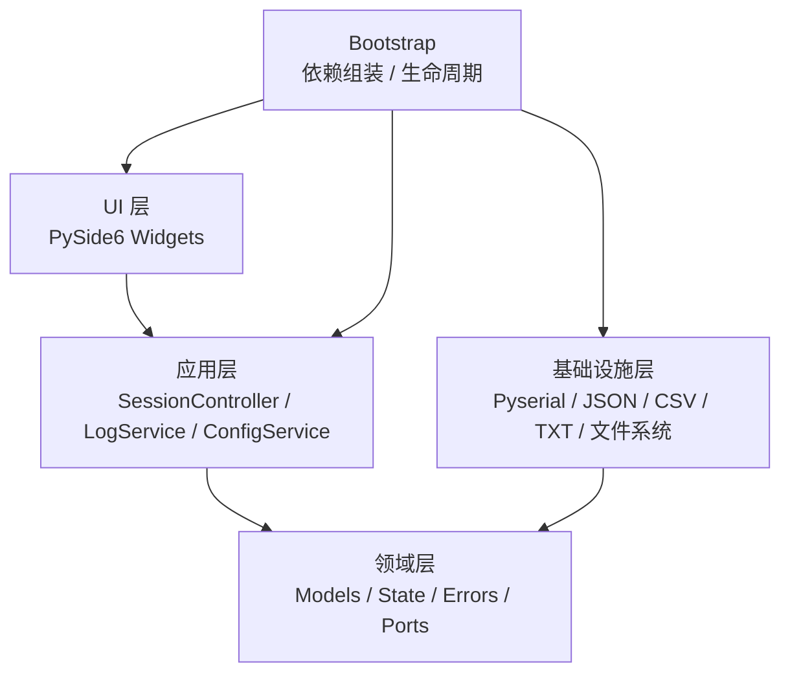
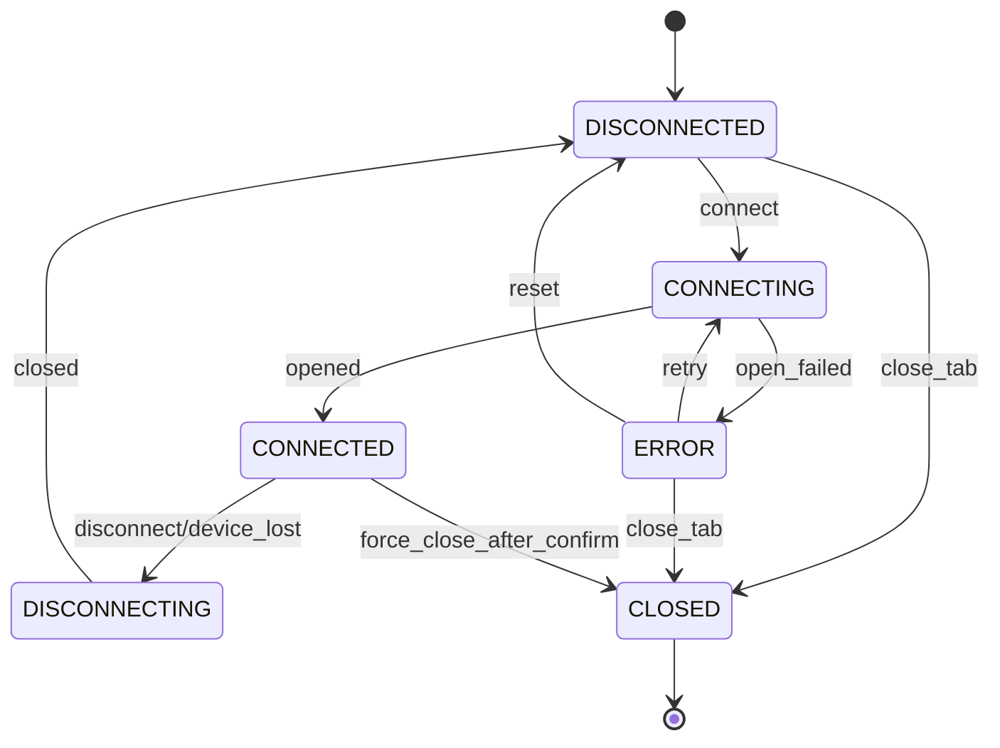
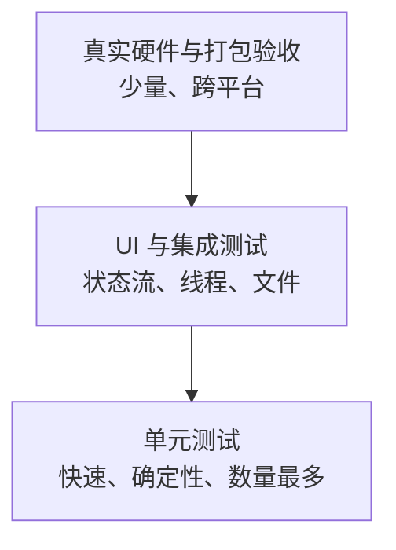

# QSerialTool 详细实施计划

> 文档版本：1.0  
> 编制日期：2026-10-01  
> 编制时间：2026-10-01 18:30:35 CST（星期四）  
> 文档状态：可执行基线  
> 目标版本：V1 / MVP  
> 技术基线：Python 3.10 + PySide6 + pyserial + PyInstaller  
> 目标平台：Windows 10/11 x64、主流 Linux x64  
> 项目许可证：MIT  
> 文档性质：V1 需求与设计基线；当前实现细节见 `docs/developer-guide.md`，当前使用方式见 `docs/user-guide.md`。  
> 更新时间：2026-10-02 09:32:11 CST（星期五）

## 1. 文档目的

本文档将 QSerialTool V1 的产品需求转化为可执行、可验证、可维护的工程实施计划。文档同时约束产品行为、架构边界、接口契约、并发模型、数据持久化、测试策略、发布流程和扩展方式。

本文档遵循以下原则：

1. 所有关键决策必须有明确默认值，不能把产品行为留给开发人员临场决定。
2. 每个功能必须具有可测试的验收标准。
3. 模块边界必须通过依赖方向约束，而不是仅依赖开发者约定。
4. 并发、日志、配置和错误处理必须作为一等设计对象，而不是实现完成后的补丁。
5. V1 只实现已验证的 MVP 需求，同时为后续扩展保留经过论证的接缝。
6. 文档中的事实、假设、风险和技术债必须明确区分。

## 2. 项目概览

### 2.1 产品定位

QSerialTool 是一个面向嵌入式开发者、硬件工程师、测试人员和普通串口用户的跨平台桌面串口调试助手。

V1 的主要价值是：

- 同时调试多个串口设备。
- 稳定、透明地发送和接收文本及二进制数据。
- 快速配置常用串口参数并保留多个调试会话。
- 在长时间运行中保留可导出、可追溯的数据记录。
- 在 Windows 和 Linux 上提供一致的交互体验。

### 2.2 目标用户

| 用户类型 | 主要任务 | V1 关键诉求 |
|---|---|---|
| 嵌入式开发者 | 查看设备启动日志、输入命令、调试 MCU | 稳定接收、发送历史、时间戳、中文编码 |
| 硬件工程师 | 验证 UART 连通性、切换电平控制和参数 | 完整串口参数、DTR/RTS、HEX 收发 |
| 测试人员 | 对设备进行重复命令和长时间观察 | 周期发送、日志文件、多标签并行 |
| 普通串口用户 | 连接 USB 转串口设备并查看数据 | 易用界面、错误提示、单文件启动 |

### 2.3 成功标准

V1 只有同时满足以下条件才算完成：

1. Windows 和 Linux 均可从源码运行，并可分别构建单文件程序。
2. 至少可以同时打开两个独立串口标签并并行收发。
3. 文本和 HEX 收发结果可验证为字节级一致，不因界面切换而修改数据。
4. 100,000 条记录或 32 MiB 缓冲上限策略明确且不会导致 UI 无界增长。
5. 端口拔出、端口占用、权限不足和日志写入失败均不会导致主程序崩溃。
6. 配置关闭程序后可恢复标签参数，但不会自动占用或连接串口。
7. 自动日志与手动导出在定义的字段和格式下可通过测试验证。
8. 核心领域和会话控制模块具有自动化测试，真实硬件测试流程有明确检查表。
9. 项目满足 MIT 许可证和第三方依赖许可证披露要求。
10. 用户在没有开发者环境的情况下可以运行单文件产物。

### 2.4 V1 范围

V1 包含：

- 单主窗口与多标签会话。
- 每个标签一个独立串口连接。
- 完整基础串口参数。
- 端口列表刷新与热插拔感知。
- 文本/HEX 显示和发送。
- UTF-8、GB18030、ASCII 编码。
- 时间戳、收发方向区分、显示过滤、暂停、清屏和自动滚动。
- 发送历史、换行策略和周期发送。
- 可选自动日志、TXT/CSV 手动导出。
- 系统/浅色/深色主题。
- 配置持久化、错误提示和安全退出。
- Windows/Linux 源码运行与本地单文件构建。

### 2.5 V1 明确排除

- 文件发送和文件分块传输。
- Modbus、CAN 桥接或其他协议解析。
- 自定义脚本、宏语言和自动化用例。
- 自定义快捷指令槽。
- 日志回放和时序分析。
- 实时图表、波形和数据分析。
- 自动重连和后台抢占串口。
- 网络串口、TCP/UDP 转发和远程调试。
- 多窗口、系统托盘驻留和开机启动。
- 自动更新、遥测和崩溃上报。
- 插件市场或稳定插件 API。
- 完整 CI/CD 发布流水线和正式代码签名；当前 GitHub Actions 只承担质量门禁，不发布产物。

### 2.6 当前项目状态

- M0-M5 已实现，当前软件版本为 `0.1.0`。
- 当前实现开发指南见 `docs/developer-guide.md`，用户操作见 `docs/user-guide.md`。
- GitHub Actions 已承担文档同步、Ruff 和 pytest 快速质量门禁；单文件构建仍在对应操作系统本地执行。
- Windows/Linux 真实串口、单文件冷启动和长时间稳定性验收仍按发布清单执行。

## 3. 工程原则

### 3.1 架构原则

1. **依赖倒置**：领域层定义协议和模型，基础设施实现外部能力，UI 不允许直接依赖 pyserial。
2. **单一职责**：连接状态、串口 I/O、日志写入、配置存储和界面展示分别由独立模块负责。
3. **显式数据流**：用户操作、状态变化、串口数据和日志事件都必须通过明确接口传递。
4. **线程有界**：串口读写只能发生在会话工作线程，Qt UI 对象只能由主线程访问。
5. **默认安全**：启动不自动连接，清屏不删除自动日志，未知配置不导致程序启动失败。
6. **可测试优先**：任何涉及时间、串口、文件系统或 UI 的外部能力都必须可替换或可注入。
7. **渐进扩展**：只在已有真实需求时新增抽象，扩展点必须具有接口契约和测试策略。
8. **可观测性**：应用诊断日志与串口数据日志分离，资源状态和错误可定位。

### 3.2 科学开发约束

- 所有需求具有唯一编号、优先级和验收标准。
- 所有缺陷必须描述可复现步骤、期望行为、实际行为和影响范围。
- 并发和长时间运行问题优先通过确定性测试复现，不依赖随机等待。
- 性能结论必须在定义的数据规模和硬件环境中测量。
- 关键架构变更通过 ADR 记录背景、选项、决策和后果。
- 不引入尚未使用的框架、插件系统或数据库。

### 3.3 编码与质量要求

- 采用 `src` 布局，使用 Python 类型标注。
- 所有包和公共接口提供简明 docstring。
- 使用 Ruff 做格式检查和静态检查。
- 使用 pytest 及 pytest-qt 做测试。
- 关键领域和应用层分支覆盖率目标不低于 90%。
- 项目整体语句覆盖率目标不低于 80%。
- 禁止用 `sleep` 驱动异步测试；使用信号、事件、超时器和 Fake Clock。
- 禁止吞掉异常；底层异常必须转换为领域错误并携带上下文。

## 4. 需求规格

### 4.1 核心用户故事

| 编号 | 用户故事 | 验收摘要 |
|---|---|---|
| US-01 | 作为用户，我希望同时打开多个串口标签 | 标签可独立连接、配置、收发和关闭 |
| US-02 | 作为用户，我希望连接常见 USB 串口设备 | 可选择端口并及时刷新端口列表 |
| US-03 | 作为用户，我希望配置完整串口参数 | 波特率、数据位、校验、停止位、流控、DTR/RTS 生效 |
| US-04 | 作为用户，我希望发送文本或二进制 HEX | 输入校验明确，发送结果可验证 |
| US-05 | 作为用户，我希望查看不同编码的数据 | UTF-8、GB18030、ASCII 可独立选择 |
| US-06 | 作为用户，我希望区分收发方向和显示时间 | RX/TX 区分色，时间戳可开关 |
| US-07 | 作为用户，我希望暂停观察但不打断设备数据 | 暂停仅冻结 UI，读取和日志继续 |
| US-08 | 作为用户，我希望重复发送命令 | 支持历史记录和 10 ms 至 24 小时周期发送 |
| US-09 | 作为用户，我希望保存日志 | 可自动写 CSV/TXT，也可手动导出缓冲区 |
| US-10 | 作为用户，我希望下次打开恢复配置 | 恢复标签和参数，但不自动连接 |
| US-11 | 作为用户，我希望设备断开后保留工作上下文 | 保留标签、输入和历史并提示手动重连 |
| US-12 | 作为用户，我希望程序不因设备或磁盘异常崩溃 | 错误可恢复并向用户说明 |

### 4.2 功能需求登记

| ID | 需求 | 优先级 | 可验证标准 |
|---|---|---|---|
| FR-001 | 多标签新建、切换、关闭、重排和重命名 | P0 | 标签状态互不干扰；关闭已连接标签前确认；标签可重命名并随配置持久化 |
| FR-002 | 端口扫描和热插拔刷新 | P0 | 未连接时每 30 秒扫描并支持手动刷新；缺失端口保留配置 |
| FR-003 | 完整串口参数配置 | P0 | 所有标准参数及自定义波特率可应用或给出错误 |
| FR-004 | DTR/RTS 控制 | P0 | 连接前后按定义生效，不触发未说明的副作用 |
| FR-005 | 文本与 HEX 接收展示 | P0 | 切换仅改变显示，原始日志不变 |
| FR-006 | 文本与 HEX 发送 | P0 | HEX 非法输入阻止发送并说明位置 |
| FR-007 | 字符编码选择 | P0 | UTF-8、GB18030、ASCII 跨块解码正确 |
| FR-008 | 时间戳和方向显示 | P0 | 可关闭时间戳；RX/TX 有稳定区分 |
| FR-009 | 显示过滤 | P0 | 可单独显示 RX、TX 或两者 |
| FR-010 | 暂停、自动滚动和清屏 | P0 | 暂停不停止读取；清屏只清内存缓冲 |
| FR-011 | 发送历史 | P0 | 最多 100 条，可在标签内复用 |
| FR-012 | 周期发送 | P0 | 可启动、停止；断开和关闭标签时强制停止 |
| FR-013 | 自动日志 | P0 | 可选 CSV/TXT；写入失败不影响串口收发 |
| FR-014 | 手动日志导出 | P0 | 导出当前内存缓冲，格式和字段稳定 |
| FR-015 | 配置持久化 | P0 | 标签参数和全局偏好关闭后可恢复 |
| FR-016 | 主题切换 | P1 | 跟随系统、浅色、深色可选 |
| FR-017 | 应用诊断日志 | P1 | 记录生命周期、错误和版本，不默认记录串口载荷 |
| FR-018 | 会话错误恢复 | P0 | 端口异常后状态、提示和资源清理一致 |
| FR-019 | 单文件构建 | P0 | Windows/Linux 各自生成可启动单文件 |
| FR-020 | 许可证与文档 | P0 | 包含 README、MIT、第三方声明和版本信息 |
| FR-021 | 终端视图 | P1 | 每个标签可切换原始 RX 文本流和末尾内联输入；设备输出 `#` 后可直接续输；回车发送、上下键历史、多行粘贴逐行发送；仅设备回显；顶部菜单保留发送设置；重启恢复视图模式 |

### 4.3 非功能需求

| ID | 类别 | 要求 |
|---|---|---|
| NFR-001 | 性能 | 持续接收时 UI 不应因串口 I/O 阻塞；刷新采用批量事件 |
| NFR-002 | 内存 | 每标签缓冲不超过 100,000 条或 32 MiB 原始数据 |
| NFR-003 | 稳定性 | 连续运行至少 2 小时，无崩溃、无无界内存增长 |
| NFR-004 | 可恢复性 | 配置损坏、日志失败、设备拔出均不导致主程序退出 |
| NFR-005 | 可维护性 | 领域层不依赖 PySide6 和 pyserial |
| NFR-006 | 可测试性 | 串口、时钟、配置路径和文件系统可注入 |
| NFR-007 | 兼容性 | Python 3.10 基线；Windows 10/11 x64；Ubuntu 22.04 及以上 |
| NFR-008 | 隐私 | 串口数据只保存在本地，除非用户主动导出或复制 |
| NFR-009 | 可访问性 | 表单控件有文字标签，支持键盘导航和可见焦点 |
| NFR-010 | 可发布性 | 单文件产物启动后能创建配置、连接或明确提示无串口 |

## 5. 总体架构

### 5.1 分层结构



### 5.2 依赖规则

1. `domain` 不依赖项目内其他层，也不依赖 PySide6、pyserial。
2. `application` 可以依赖 `domain`，不能直接依赖 pyserial、Qt Widget 或具体文件格式。
3. `infrastructure` 依赖 `domain` 中定义的 Port 协议，并实现外部能力。
4. `ui` 依赖 `application` 暴露的用例和只读状态，不直接操作 Transport。
5. `bootstrap` 是唯一负责创建具体实现并完成依赖注入的位置。
6. 不允许通过包级全局单例隐藏依赖。

### 5.3 进程、线程和对象边界

- 一个进程只有一个 Qt GUI 主线程。
- 每个已连接标签对应一个 SessionController 和一个 SerialWorker 线程。
- 未连接标签不存在工作线程。
- Transport 对象由所属工作线程独占，除关闭协调外不得跨线程调用。
- UI 只接收不可变状态快照或可序列化事件。
- 文件日志由 LogService 管理；每个标签具有独立 LogSink。
- 配置持久化在主线程之外的短命任务或同步小文件操作中完成，避免阻塞 UI 的原子替换。

### 5.4 建议目录结构

```text
QSerialTool/
├─ docs/
│  ├─ implementation-plan.md
│  └─ adr/
├─ src/
│  └─ qserialtool/
│     ├─ bootstrap/
│     ├─ domain/
│     ├─ application/
│     ├─ infrastructure/
│     ├─ ui/
│     └─ __main__.py
├─ tests/
│  ├─ unit/
│  ├─ integration/
│  ├─ ui/
│  └─ fixtures/
├─ scripts/
│  ├─ build.ps1
│  └─ build.sh
├─ packaging/
│  └─ qserialtool.spec
├─ pyproject.toml
├─ README.md
├─ LICENSE
└─ THIRD_PARTY_NOTICES.md
```

## 6. 模块设计

### 6.1 领域层 `domain`

职责：

- 定义串口配置、会话状态、日志记录、方向和错误类型。
- 实现与框架无关的验证和值对象规则。
- 定义外部能力的 Port 协议。

不得承担：

- 创建线程。
- 调用 pyserial。
- 更新 Qt 控件。
- 打开具体文件或决定配置路径。

核心模块：

| 模块 | 职责 |
|---|---|
| `models.py` | `SerialConfig`、`SessionPreferences`、`LogRecord`、`SessionSnapshot` |
| `states.py` | `SessionState` 和状态转换规则 |
| `errors.py` | 分类错误、用户提示键、是否可恢复 |
| `ports.py` | `Transport`、`ConfigStore`、`LogSink`、`Clock` 协议 |

### 6.2 应用层 `application`

职责：

- 编排连接、断开、发送、日志和配置用例。
- 管理多个 SessionController。
- 将底层错误转换为用户可理解的会话错误。
- 维护活动会话注册表并协调应用退出。

核心模块：

| 模块 | 职责 |
|---|---|
| `session_controller.py` | 单标签生命周期和状态机 |
| `session_manager.py` | 多标签创建、关闭、注册和全局关闭 |
| `send_service.py` | 发送历史、周期调度、写入排队 |
| `receive_service.py` | 接收事件、缓冲淘汰和 UI 批次 |
| `log_service.py` | 格式选择、自动日志生命周期和导出 |
| `config_service.py` | 配置加载、迁移、保存和损坏恢复 |

### 6.3 基础设施层 `infrastructure`

职责：

- 提供 pyserial Transport。
- 枚举系统串口。
- 实现 JSON 配置存储。
- 实现 CSV/TXT 日志写入。
- 提供真实系统时钟和线程/定时器适配。

核心模块：

| 模块 | 职责 |
|---|---|
| `serial_transport.py` | pyserial 实现和异常映射 |
| `port_scanner.py` | 端口名、描述和设备标识读取 |
| `json_config_store.py` | 原子 JSON 读写和备份 |
| `csv_log_sink.py` | CSV 写入和转义 |
| `txt_log_sink.py` | 人类可读日志写入 |
| `app_logging.py` | 诊断日志初始化和轮转 |

### 6.4 UI 层 `ui`

职责：

- 提供主窗口、标签、连接表单、收发面板和设置。
- 将用户操作转换为应用层命令。
- 渲染状态快照和日志事件。
- 管理主题、快捷键和基本可访问性。

不得承担：

- 直接打开串口。
- 直接拼装 CSV 或 JSON。
- 在工作线程内访问控件。
- 保存业务状态的第二份真相。

主要界面组件：

| 组件 | 内容 |
|---|---|
| `MainWindow` | 菜单、标签容器、全局状态和设置入口 |
| `SessionTab` | 单个串口的完整布局 |
| `ConnectionPanel` | 端口参数、连接、断开、DTR/RTS |
| `ReceivePanel` | 文本/HEX、过滤、时间戳、暂停、清屏、自动滚动 |
| `SendPanel` | 编辑器、格式、编码、换行、历史、周期发送 |
| `LogPanel` | 自动日志设置、打开日志目录、导出 |
| `SettingsDialog` | 主题、默认配置、日志目录和版本 |
| `ThemeManager` | 系统、浅色、深色主题 |

### 6.5 Bootstrap

职责：

- 解析应用数据路径。
- 创建配置存储、日志工厂、串口扫描器和 SessionManager。
- 处理 Qt 应用启动、未捕获异常兜底和退出清理。
- 保留唯一组合根，禁止业务模块自行构造全局依赖。

## 7. 核心接口与数据模型

### 7.1 `SerialConfig`

```python
@dataclass(frozen=True, slots=True)
class SerialConfig:
    port: str
    baudrate: int = 115200
    bytesize: int = 8
    parity: Literal["N", "E", "O", "M", "S"] = "N"
    stopbits: float = 1.0
    flow_control: Literal["none", "xonxoff", "rtscts", "dsrdtr"] = "none"
    dtr: bool = True
    rts: bool = True
    encoding: Literal["utf-8", "gb18030", "ascii"] = "utf-8"
```

约束：

- `port` 连接时不得为空。
- `baudrate` 必须为正整数。
- `bytesize` 仅允许 5、6、7、8。
- `stopbits` 仅允许 1、1.5、2。
- 所有非法组合在 UI 层阻止，并在领域层再次校验。

### 7.2 `SessionState`

```python
class SessionState(StrEnum):
    DISCONNECTED = "disconnected"
    CONNECTING = "connecting"
    CONNECTED = "connected"
    DISCONNECTING = "disconnecting"
    ERROR = "error"
    CLOSED = "closed"
```

`ERROR` 表示保留可恢复信息的异常状态。用户可以修复端口参数后重新连接。`CLOSED` 只用于标签销毁阶段，关闭后不可复用。

### 7.3 `Transport`

```python
class Transport(Protocol):
    def open(self, config: SerialConfig) -> None: ...
    def close(self, timeout: float) -> None: ...
    def read(self, max_bytes: int, timeout: float) -> bytes: ...
    def write_all(self, data: bytes, timeout: float) -> None: ...
    def set_line_state(self, *, dtr: bool, rts: bool) -> None: ...
    @property
    def is_open(self) -> bool: ...
```

线程约束：

- 除 `is_open` 外，所有方法只能在所属 SerialWorker 线程调用。
- `read` 超时返回空字节，不视为错误。
- `write_all` 必须处理部分写入；超时或短写抛出传输错误。
- 底层异常不得直接泄漏到 UI，必须映射为应用错误。

### 7.4 `LogRecord`

```python
@dataclass(frozen=True, slots=True)
class LogRecord:
    timestamp_utc: datetime
    direction: Literal["rx", "tx", "system"]
    raw: bytes
    encoding: str
    text: str
    hex_text: str
    session_id: str
```

约束：

- `timestamp_utc` 使用带时区的 UTC 时间，展示和导出再转换成本地时区。
- `raw` 是唯一权威数据源。
- 文本和 HEX 字段是派生表示，不得反向修改原始数据。
- `system` 记录可用于自动日志说明连接、断开和错误，但不参与接收显示过滤统计。

### 7.5 `SessionSnapshot`

```python
@dataclass(frozen=True, slots=True)
class SessionSnapshot:
    session_id: str
    title: str
    state: SessionState
    config: SerialConfig
    last_error: UserFacingError | None
    rx_bytes: int
    tx_bytes: int
    dropped_records: int
```

快照是 UI 渲染所需状态的唯一来源。UI 不得读取工作线程内部字段。

### 7.6 配置数据模型

```python
@dataclass(frozen=True, slots=True)
class SessionPreferences:
    title: str
    config: SerialConfig
    display_mode: Literal["text", "hex"]
    show_timestamp: bool
    show_rx: bool
    show_tx: bool
    autoscroll: bool
    auto_log_enabled: bool
    auto_log_format: Literal["csv", "txt"]
    auto_log_directory: str
    send_history: tuple[str, ...]
    send_mode: Literal["text", "hex"]
    line_ending: Literal["none", "cr", "lf", "crlf"]
    periodic_interval_ms: int
    view_mode: Literal["split", "terminal"]

@dataclass(frozen=True, slots=True)
class AppConfig:
    schema_version: int
    theme: Literal["system", "light", "dark"]
    window_geometry: str | None
    window_state: str | None
    active_session_index: int
    sessions: tuple[SessionPreferences, ...]
```

## 8. 会话状态机



状态转换规则：

| 当前状态 | 事件 | 目标状态 | 行为 |
|---|---|---|---|
| DISCONNECTED | connect | CONNECTING | 校验参数、创建 Worker、打开端口 |
| CONNECTING | open success | CONNECTED | 启动读取循环，开启自动日志 |
| CONNECTING | open failed | ERROR | 保留配置，关闭临时资源，展示原因 |
| CONNECTED | disconnect | DISCONNECTING | 停止周期发送，停止读取，刷盘日志 |
| CONNECTED | fatal I/O error | DISCONNECTING | 按异常断开处理并记录原因 |
| DISCONNECTING | cleanup complete | DISCONNECTED | 关闭端口，保留标签与会话记录 |
| DISCONNECTING | cleanup timeout | ERROR | 记录超时，强制释放句柄 |
| ERROR | connect | CONNECTING | 使用当前配置重新尝试 |
| 任意非 CLOSED | close tab | CLOSED | 清理资源；已连接时先确认 |

禁止的转换：

- `CONNECTED` 不得直接跳到 `CLOSED`，除非用户确认强制关闭。
- `CLOSED` 不得回到其他状态。
- 同一会话不得同时存在两个活动 Worker。

## 9. 关键数据流

### 9.1 连接

1. UI 提交连接命令和当前表单值。
2. SessionController 执行领域校验。
3. SessionManager 检查端口是否已被本应用其他会话占用。
4. Controller 状态切换为 CONNECTING。
5. SerialWorker 创建 Transport 并执行 open。
6. 打开成功后应用 DTR/RTS 持久状态，启动读取循环和周期发送调度。
7. Controller 发布 CONNECTED 快照。
8. 若启用自动日志，LogService 在同一会话中建立新日志文件；开启失败只降级日志功能。

### 9.2 接收

1. SerialWorker 以不阻塞 UI 的超时参数读取最多 8192 字节。
2. 非空字节形成 RX LogRecord。
3. LogRecord 写入内存缓冲。
4. 若自动日志开启，写入对应 LogSink。
5. ReceiveService 在约 33 ms 窗口内合并 UI 更新事件。
6. UI 按当前显示模式渲染；文本模式使用增量解码器。
7. 超过缓冲上限时丢弃最旧记录并累计 `dropped_records`。
8. UI 首次发生丢弃时显示一次醒目状态提示，不重复弹窗。

### 9.3 发送

1. UI 验证 HEX 语法；按换行策略构造出的 payload 为空时视为无操作，不进入发送队列。
2. 文本模式按当前编码转换；HEX 模式解析字节。
3. 根据换行策略追加 CR、LF 或 CRLF。
4. 发送任务进入有界命令队列。
5. SerialWorker 调用 `write_all`。
6. 成功后形成 TX LogRecord，写入缓冲和自动日志。
7. 失败时标记会话错误，停止周期发送，并根据错误决定断开或保留连接。
8. 发送历史只记录成功入队的原始编辑器内容，最多保留 100 条，连续重复内容合并。

### 9.4 暂停与清屏

- 暂停：只停止新事件到 UI 的追加；读取、缓冲和自动日志持续进行。
- 恢复：将当前可显示缓冲的最新内容同步到界面，不伪造丢失数据。
- 清屏：清空当前标签内存缓冲和界面；自动日志文件和 TX/RX 累计字节数不受影响。
- 清屏前若非空，要求用户确认。

### 9.5 断开与应用退出

1. 停止新发送和周期调度。
2. 通知 Worker 停止读取。
3. 等待当前写入完成或超时。
4. 刷新并关闭日志文件。
5. 关闭 Transport。
6. 清理线程并发布 DISCONNECTED 快照。
7. 应用退出时对全部会话执行相同流程；任何清理错误写入诊断日志。

## 10. 并发、性能与资源控制

### 10.1 线程模型

- 一个 SessionController 对应一个串口 Worker 线程。
- Worker 使用命令队列接收 connect、disconnect、write、set_line_state 和 stop。
- Worker 读取循环使用固定最大读取块 8192 字节。
- UI 事件队列使用背压策略，只保留最新合并批次。
- 不在 Worker 中创建 Qt Widget；通过线程安全信号发布不可变事件。

### 10.2 缓冲策略

| 资源 | 上限 | 超限处理 |
|---|---|---|
| 内存日志记录 | 100,000 条 | 丢弃最旧记录 |
| 原始字节 | 32 MiB | 与记录上限共同触发淘汰 |
| 发送队列 | 256 项 | 拒绝新任务并提示队列已满 |
| 发送历史 | 100 条 | 删除最旧记录 |
| UI 渲染记录 | 最近 2000 条 | 更早记录只保留在内存与导出，界面只渲染尾部并提示隐藏条数 |
| 单次读取 | 8192 字节 | 分多次读取 |

### 10.3 性能验证

- 使用 Fake Transport 注入固定速率的 1 KiB 数据块。
- 验证 10 MiB 数据接收期间主线程不阻塞。
- 验证 HEX 展示切换不会导致原始统计数据变化。
- 验证 100,000 条淘汰时内存保持有界。
- 记录 CPU、内存、UI 帧响应和丢弃数量，形成基线结果。
- 性能测试不作为普通单元测试的固定阈值，防止不同硬件造成 CI 波动；结果记录在测试报告中。

## 11. 串口行为规范

### 11.1 支持参数

| 参数 | 支持值 | 默认值 |
|---|---|---|
| 端口 | 系统可用串口 | 无，用户选择 |
| 波特率 | 常见值 + 自定义正整数 | 115200 |
| 数据位 | 5、6、7、8 | 8 |
| 校验位 | None、Even、Odd、Mark、Space | None |
| 停止位 | 1、1.5、2 | 1 |
| 流控 | None、XON/XOFF、RTS/CTS、DSR/DTR | None |
| DTR | 开/关 | 开 |
| RTS | 开/关 | 开 |
| 编码 | UTF-8、GB18030、ASCII | UTF-8 |
| 换行 | 无、CR、LF、CRLF | LF |

### 11.2 端口发现

- Windows 枚举 `COMx`，端口列表项显示「设备名 · 友好描述」，端口框只显示设备名；描述缺失或与设备名重复时不追加描述，描述过长时弹窗按最长项加宽。
- Linux 枚举 `/dev/ttyUSB*`、`/dev/ttyACM*` 及其他 pyserial 可识别端口。
- 端口列表按自然顺序排序。
- 未连接标签每 30 秒自动刷新，并提供端口行 ⟳ 手动刷新按钮即时枚举；连接中的标签不重建下拉列表，避免选择抖动。
- 已选端口消失时继续保留字符串并标记“不可用”，不自动切换其他端口。

### 11.3 重复端口规则

- 同一应用内以规范化设备标识判断是否重复。
- 当端口已被其他标签连接时，默认阻止连接并聚焦已有标签。
- 不依赖“打开失败”来发现本应用内部的重复连接。

### 11.4 Linux 权限

遇到权限错误时，可提供 `/dev/tty*` 权限或加入 `dialout` 用户组的提示，但不自动执行提权命令。应用不得以 root 身份自动重启。

## 12. 界面设计

### 12.1 主窗口布局

```text
┌─────────────────────────────────────────────────────────────┐
│ 菜单   新建标签  主题  设置                             状态 │
├─────────────────────────────────────────────────────────────┤
│ [标签1] [标签2] [标签3]                                  [+] │
├─────────────────────────────────────────────────────────────┤
│ 端口 [下拉] 波特率 [下拉/输入] 数据位 [下拉] 校验 [下拉]    │
│ 停止位 [下拉] 流控 [下拉] DTR [开关] RTS [开关] [连接]      │
├─────────────────────────────────────────────────────────────┤
│ 接收区：文本/HEX | 时间戳 | RX | TX | 暂停 | 清屏 | 自动滚动 │
│                                                             │
│ [ RX ... ]                                                  │
│ [ TX ... ]                                                  │
├─────────────────────────────────────────────────────────────┤
│ 发送区：文本/HEX | 编码 | 换行 | 历史 | 周期 [ms] | 发送    │
│ [ 编辑框 ]                                                  │
├─────────────────────────────────────────────────────────────┤
│ 状态：已连接 COM3 115200 8-N-1 | RX: 1.2 KB | TX: 32 B    │
└─────────────────────────────────────────────────────────────┘
```

### 12.2 交互规则

- 新建标签快捷键：`Ctrl+T`。
- 关闭当前标签快捷键：`Ctrl+W`。
- 发送快捷键：`Ctrl+Enter`。
- 清屏快捷键：`Ctrl+L`，执行前确认非空缓冲。
- 连接按钮根据状态切换为连接、正在连接、断开或重试。
- 参数控件在 CONNECTING 阶段锁定；CONNECTED 阶段只允许 DTR/RTS 和显示选项变化。
- 修改端口或通信参数必须断开后重新连接才生效。
- 错误提示优先使用内联状态和状态栏，不连续弹出阻塞对话框。
- 关闭已连接标签必须说明端口会被释放，并保留确认机会。
- 接收标题行右侧提供每标签独立的“终端/分栏”切换按钮：终端视图隐藏独立发送面板及时间戳/RX/TX 过滤控件，把 RX 文本按原始顺序连续渲染，在流末尾内联输入；不添加应用提示符或强制换行，回车发送、上下键召回历史、多行粘贴逐行发送；发送成功后移除本地草稿，仅等待设备回显；切回分栏恢复原比例；切换会停止周期发送。

### 12.3 显示细节

- TX 默认蓝色，RX 默认绿色，系统消息默认灰色；颜色需满足深浅主题对比度。
- 时间戳格式：`YYYY-MM-DD HH:mm:ss.SSS`。
- HEX 显示格式：大写、两字符一字节、空格分隔，例如 `AA 01 FF 0D`。
- 文本模式使用增量解码器，跨块多字节字符不得显示为乱码或被拆散。
- 无法解码的字节显示为等价十六进制占位，不影响原始缓冲和导出。
- 默认自动滚动开启，用户手动向上滚动后可暂时暂停自动滚动，回到底部后恢复。

### 12.4 主题

- `system`：读取系统偏好；无法判断时使用浅色。
- `light`：固定浅色。
- `dark`：固定深色。
- 主题只定义颜色、字体和间距令牌，不改变业务行为。
- Windows 和 Linux 均需检查下拉框、工具提示、滚动条和禁用态的对比度。

## 13. 配置与持久化

### 13.1 路径

| 平台 | 配置路径 |
|---|---|
| Windows | `%APPDATA%/QSerialTool/settings.json` |
| Linux | `$XDG_CONFIG_HOME/QSerialTool/settings.json`，未设置时为 `~/.config/QSerialTool/settings.json` |

配置路径通过 QStandardPaths 计算，测试中注入临时目录。

### 13.2 JSON 示例

```json
{
  "schema_version": 1,
  "theme": "system",
  "window_geometry": "base64-or-qt-encoded-state",
  "window_state": "base64-or-qt-encoded-state",
  "active_session_index": 0,
  "sessions": [
    {
      "title": "COM3",
      "config": {
        "port": "COM3",
        "baudrate": 115200,
        "bytesize": 8,
        "parity": "N",
        "stopbits": 1.0,
        "flow_control": "none",
        "dtr": true,
        "rts": true,
        "encoding": "utf-8"
      },
      "display_mode": "text",
      "show_timestamp": true,
      "show_rx": true,
      "show_tx": true,
      "autoscroll": true,
      "auto_log_enabled": false,
      "auto_log_format": "csv",
      "auto_log_directory": "",
      "send_history": []
    }
  ]
}
```

### 13.3 写入策略

1. 写入同目录临时文件。
2. 对临时文件执行 flush 和 fsync。
3. 使用原子替换覆盖正式配置。
4. 保留最近一个成功配置备份。
5. 保存采用 500 ms 去抖，应用正常退出时强制保存。

### 13.4 读取和迁移

- 不存在配置时使用默认配置并创建标签 1。
- JSON 语法错误、schema 不兼容或字段类型错误时，先备份为 `settings.corrupt.<timestamp>.json`。
- 单个标签配置无效时只跳过或修复该标签，不丢弃其他有效标签。
- schema 迁移通过注册表按版本顺序执行，禁止在 UI 中临时补字段。
- V1 只接受 `schema_version=1`；未来版本必须提供迁移函数。

### 13.5 恢复规则

- 恢复标签顺序、标题、参数、显示偏好、视图模式和发送历史。
- 不恢复连接、不重启周期发送、不自动占用端口。
- 自动日志开关可以恢复；用户再次连接时创建新的带时间戳文件，不追加旧文件。
- 窗口几何状态异常时回退到默认尺寸，并确保窗口位于可见屏幕范围。

## 14. 日志设计

### 14.1 分离原则

- **串口数据日志**：记录 RX/TX/系统事件，由用户开启或导出。
- **应用诊断日志**：记录启动、关闭、未捕获异常和基础设施错误，默认轮转保存。
- 诊断日志不得默认记录完整串口载荷，避免隐私和体积风险。

### 14.2 CSV 格式

UTF-8 with BOM，便于 Windows 表格软件识别中文。字段固定为：

```csv
timestamp,direction,encoding,text,hex
2026-10-01T18:28:55.123+08:00,RX,utf-8,hello,68 65 6C 6C 6F
2026-10-01T18:28:56.001,TX,utf-8,ok,6F 6B
```

字段规则：

- `timestamp` 使用 ISO 8601 且包含本地时区偏移和毫秒。
- `direction` 仅允许 `RX`、`TX`、`SYSTEM`。
- `text` 对换行、逗号、引号按 RFC 4180 转义；无法解码内容使用明确的转义表示。
- `hex` 是原始字节的权威文本表示，使用大写和空格分隔。
- 每行代表一个读取批次或一次完整写操作，不人为重新分帧。

### 14.3 TXT 格式

```text
[2026-10-01 18:28:55.123 +08:00] RX [UTF-8] hello
[2026-10-01 18:28:56.001 +08:00] TX [UTF-8] ok
[2026-10-01 18:28:56.100 +08:00] SYSTEM [UTF-8] disconnected: device not found
```

TXT 是人工阅读格式，允许显示转义后的文本；需要无损数据的用户应选择 CSV。

### 14.4 自动日志

- 默认关闭。
- 启用时让用户选择目录；默认建议用户文档目录下的 `QSerialTool/Logs`。
- 文件名：`QSerialTool_<sanitized-port>_<YYYYMMDD_HHmmss>.<ext>`。
- 端口名清理 Windows/Linux 非法字符并限制长度。
- 每个标签每次连接创建新文件；不跨连接追加。
- LogSink 至少每 1 秒、每 256 KiB 或在正常关闭时 flush。
- 磁盘满或写入失败时停止自动日志并显示非阻塞错误；串口连接继续。
- 日志目录创建失败时禁用自动日志，不弹出连续错误框。

### 14.5 手动导出

- 导出范围是当前标签的完整内存缓冲，不局限于可见行或显示过滤结果。
- 导出过程冻结一份记录快照；导出期间新增数据不进入本次文件。
- 用户取消路径选择时不改变自动日志状态。
- 导出成功后在状态栏显示路径和记录数量。

## 15. 错误处理与可恢复性

### 15.1 错误分类

| 错误类型 | 示例 | 默认用户行为 |
|---|---|---|
| ValidationError | 非法波特率、非法 HEX | 阻止操作并定位字段 |
| PortNotFoundError | 设备已拔出 | 保留标签，提示手动重连 |
| PortBusyError | 端口被其他程序占用 | 保留配置，提示释放端口 |
| PermissionError | Linux 无串口权限 | 给出权限建议，不建议 root 运行 |
| TransportIOError | 读写失败 | 停止周期发送，尝试安全断开 |
| LogIOError | 磁盘满、路径不可写 | 禁用本次自动日志，不影响串口 |
| ConfigIOError | 配置不可写 | 使用内存配置并在退出时再次提示 |
| InternalError | 未预期异常 | 写诊断日志，展示可复制的错误编号 |

### 15.2 用户提示模板

每个可操作错误至少包含：

1. 发生了什么。
2. 哪个端口或标签受影响。
3. 当前连接是否保留。
4. 用户可以采取的下一步。
5. 如可复制，则提供简短诊断编号。

示例：

```text
无法打开 COM3：端口正被占用。
配置和发送内容已保留，未建立连接。
请关闭占用该端口的程序后点击“重试”。诊断编号：IO-20261001-182855-01
```

### 15.3 异常边界

- Worker 顶层捕获所有异常，转换为结构化错误事件。
- Qt 信号槽不得抛出未处理异常。
- 未捕获异常写入诊断日志；默认不显示 Python traceback 给普通用户。
- 错误恢复后清除旧错误；重试失败则更新错误而不是叠加对话框。
- 任何清理路径必须幂等，允许重复调用 stop 和 close。

## 16. 安全、隐私与合规

- 串口数据默认仅存内存，只有用户启用的自动日志和主动导出会落盘。
- 日志可能包含设备密钥、令牌或个人信息，界面首次开启日志时应进行简洁提示。
- 不自动上传日志、配置或设备信息。
- 配置不保存密码；本版本不包含凭据。
- 打开日志目录时不得执行目录中的文件。
- 文件名必须清理控制字符和路径分隔符，防止路径穿越。
- 项目采用 MIT 许可证。
- PySide6、Qt、pyserial、PyInstaller 等依赖需在 `THIRD_PARTY_NOTICES.md` 中列出版本、许可证和来源。
- 分发单文件程序时必须附带第三方许可证文本；若以 LGPL 方式使用 Qt/PySide6，需保留允许替换相关库的合规说明和项目源代码可获取信息。

## 17. 测试策略

### 17.1 测试金字塔



### 17.2 单元测试

必须覆盖：

- SerialConfig 的全部参数验证和默认值。
- HEX 解析：空值、奇数长度、非法字符、多个空格、换行和中英文全角字符。
- 增量文本解码：UTF-8 和 GB18030 字符跨读取块。
- 换行策略：无、CR、LF、CRLF。
- 日志格式：CSV 引号、逗号、换行、不可解码字节和时区。
- 缓冲淘汰：按记录数和字节数两种触发条件。
- 配置 JSON 序列化、反序列化、损坏恢复和迁移。
- 文件名清理和路径安全。
- 会话状态机的合法和非法转换。

### 17.3 应用与集成测试

使用 Fake Transport、Fake Clock 和临时目录，覆盖：

- 连接成功、端口缺失、端口忙和权限错误。
- 多标签隔离和重复端口阻止。
- 读线程接收、写队列顺序和高吞吐背压。
- 周期发送启动、停止、跳过快任务和断线自动停止。
- 接收期间暂停、恢复、清屏和自动日志继续。
- 日志写入失败后串口仍可继续收发。
- Worker 停止、重复停止和应用退出资源清理。
- 配置保存失败时程序可用且退出行为明确。

### 17.4 UI 测试

使用 pytest-qt：

- 新建、切换、重排和关闭标签。
- 连接参数控件的启用和禁用状态。
- 文本/HEX 切换、时间戳、RX/TX 过滤和自动滚动。
- 发送历史选择、HEX 错误提示和发送快捷键。
- 已连接标签关闭确认。
- 主题切换后基本控件仍可操作。
- 配置恢复后标签为 DISCONNECTED。

### 17.5 真实硬件测试矩阵

| 场景 | Windows | Linux | 验证点 |
|---|---|---|---|
| USB 转串口回环 | 必测 | 必测 | 文本和 HEX 字节一致 |
| 设备启动日志 | 必测 | 必测 | 高频数据、自动滚动、暂停 |
| GB18030 中文 | 必测 | 必测 | 跨块中文不乱码 |
| 二进制 0x00-0xFF | 必测 | 必测 | 无截断、无编码转换 |
| 运行中拔出 | 必测 | 必测 | 标签保留、可重连、无崩溃 |
| 端口被占用 | 必测 | 必测 | 错误可理解、配置保留 |
| 无权限端口 | 不适用/视驱动 | 必测 | 非 root 环境下给出权限建议 |
| 高频周期发送 | 必测 | 必测 | 停止及时、无无限队列 |
| 2 小时接收 | 必测 | 必测 | 内存有界、日志持续 |
| 单文件冷启动 | 必测 | 必测 | 无缺失 Qt 插件、配置可创建 |

### 17.6 打包验收

- 在未安装 Python 的干净 Windows 环境启动 `.exe`。
- 在 Ubuntu 22.04 干净环境启动 Linux 单文件产物。
- 检查 Qt platform plugin 可加载。
- 检查配置目录创建、日志导出和中文显示。
- 检查退出后无残留进程占用串口。
- 对产物计算 SHA-256 并记录构建环境。

## 18. 打包与发布

### 18.1 依赖基线

| 组件 | 计划版本约束 | 用途 |
|---|---|---|
| Python | 3.10.x | 运行时和构建基线 |
| PySide6 | `>=6.8,<7`，构建时锁定精确版本 | 桌面 UI |
| pyserial | 3.5 | 串口访问 |
| PyInstaller | 6.20.x | 单文件构建 |
| pytest | `>=8,<10`，构建时锁定 | 测试 |
| pytest-qt | 与 pytest 兼容的锁定版本 | Qt 测试 |
| Ruff | 构建时锁定 | 格式与静态检查 |

依赖精确版本写入锁文件；升级依赖必须重新执行完整测试和打包验收。

### 18.2 Windows 构建

- 使用独立虚拟环境。
- 运行静态检查和自动化测试。
- 使用 PyInstaller 单文件模式生成 `QSerialTool.exe`。
- 构建时包含 Qt 必需插件、主题资源和第三方许可证。
- GUI 子系统构建，不显示控制台窗口。
- 产物记录版本、构建日期、Python 版本和 SHA-256。

### 18.3 Linux 构建

- 在 Ubuntu 22.04（glibc 2.35）构建，以覆盖声明的最低 Linux 基线。
- 使用独立虚拟环境并生成单个 ELF 可执行文件。
- 验证平台插件 `xcb` 所需系统库可用。
- 若目标发行版缺少基础图形库，文档必须列出系统依赖和错误排查方式。
- 产物记录版本、构建日期、Python 版本和 SHA-256。

### 18.4 单文件限制

- 首次启动会将运行文件解压到临时目录，因此比文件夹模式慢。
- 临时目录无执行权限或磁盘空间不足时可能启动失败，需在文档中给出处理建议。
- 单文件不能跨操作系统构建，Windows 产物必须在 Windows 构建，Linux 产物必须在 Linux 构建。
- V1 不签名、不自动更新；发布说明必须明确来源和校验值。

## 19. 工程流程与质量门禁

### 19.1 开发流程

1. 需求变更先更新本文档或 ADR。
2. 功能开发按“接口/测试先行 → 最小实现 → UI 集成 → 重构”的顺序执行。
3. 提交前运行文档同步检查、Ruff、单元测试和应用测试。
4. 真实硬件相关改动必须更新硬件测试清单。
5. 受影响文档必须与代码和测试在同一提交中更新。
6. 发布前运行完整测试、跨平台构建和干净环境验收。

### 19.2 质量门禁

- 无高危静态检查错误。
- 所有单元测试通过。
- 关键状态机、缓冲和编解码测试通过。
- 不存在未处理的 Qt 跨线程访问。
- 不存在无上限队列或无上限内存结构。
- 配置损坏恢复测试通过。
- Windows 和 Linux 单文件冷启动测试通过。
- README、许可证、第三方声明、用户手册、开发指南和文档索引完整。
- 文档同步 Hook 与 CI 检查通过，变更范围与文档更新一致。
- 文档中的默认值与最终实现一致。

## 20. 实施阶段与里程碑

| 里程碑 | 内容 | 主要交付物 | 完成标准 |
|---|---|---|---|
| M0 工程初始化 | 项目结构、pyproject、许可证、Ruff、pytest、README | 可安装的开发骨架 | 测试和静态检查命令可运行 |
| M1 核心领域 | 模型、状态机、Port 协议、HEX/编码、缓冲 | 单元测试通过 | 不依赖 Qt 和硬件即可验证核心行为 |
| M2 串口链路 | pyserial Transport、Worker、命令队列、会话控制器 | 无界面集成测试通过 | 可连接/断开、读写、处理异常 |
| M3 基础 UI | 主窗口、多标签、连接面板、收发面板 | 可手工完成基础收发 | 两标签独立工作，UI 不阻塞 |
| M4 完整 MVP | 日志、周期发送、历史、主题、配置恢复 | 完整功能和 UI 测试 | 所有 P0 需求验收 |
| M5 发布质量 | 硬件测试、压力测试、单文件打包、文档和许可证 | Windows/Linux 发布候选 | 通过干净环境验收和质量门禁 |

### 20.1 里程碑执行顺序

1. 先建立可重复的开发、测试和错误模型，再连接界面。
2. 基础串口链路未稳定前不开发协议解析等扩展功能。
3. UI 只在应用层用例和 Fake Transport 测试完成后接入。
4. 打包只在功能冻结后进入稳定分支，避免同时调试业务和打包问题。

## 21. 风险与缓解

| 风险 | 概率 | 影响 | 缓解措施 |
|---|---|---|---|
| 跨线程访问导致随机崩溃 | 中 | 高 | Worker 独占 Transport；禁止 UI 直接调用；增加集成测试 |
| 高频数据导致 UI 卡顿 | 中 | 高 | 批量事件、QPlainTextEdit、固定缓冲、性能基线测试 |
| pyserial 跨平台异常差异 | 高 | 中 | 统一异常映射；Windows/Linux 分别测试 |
| Linux 权限和发行版差异 | 高 | 中 | 明确最低平台；错误提示；Ubuntu 22.04 构建 |
| 单文件启动慢或插件缺失 | 中 | 中 | 固定 spec；干净环境验收；发布说明 |
| 配置格式演进破坏兼容 | 中 | 中 | schema_version、迁移注册表、损坏备份 |
| 自动日志磁盘写满 | 低 | 中 | 周期 flush、写入错误降级、不阻塞串口 |
| PySide6 LGPL 合规疏漏 | 低 | 高 | 保留源代码、许可证和替换库说明 |
| MVP 范围持续膨胀 | 高 | 中 | 需求编号和明确排除列表；新增需求进入后续版本 |

## 22. 后续扩展路线

- 完整终端仿真：在基础文本流之后增加 CR 行覆盖、退格、ANSI SGR、ANSI 光标定位和清屏等能力；应使用独立终端模型，不得把仿真逻辑耦合到串口发送队列。

V1 只为以下能力保留设计空间，不提前实现完整抽象：

- V2 协议解析：在接收记录之后增加 `FrameParser`，不得侵入 Transport。
- V2 快捷指令：以命令模板和分组模型接入 SendService。
- V2 文件发送：作为独立 SendJob 接入发送队列，具有进度和限速。
- V2 日志回放：使用 CSV 作为稳定输入源，新增 ReplayService。
- V2 脚本：采用受限沙箱接口，禁止直接访问 UI。
- V3 网络串口：实现新的 Transport，复用 SessionController。

任何扩展必须：

1. 增加独立的接口版本或能力协商。
2. 不修改已有 CSV 字段语义。
3. 保持现有配置 schema 可迁移。
4. 有自己的测试、错误分类和文档。
5. 不得让扩展直接访问其他会话的内部状态。

## 23. 需求追溯矩阵

| 用户故事 | 关键需求 | 主要模块 | 自动化验证 | 硬件验证 |
|---|---|---|---|---|
| US-01 | FR-001、FR-003 | SessionManager / SessionTab | UI 与集成测试 | 两设备并行 |
| US-02 | FR-002、FR-004 | PortScanner / ConnectionPanel | Fake Scanner | 真实拔插 |
| US-03 | FR-003、FR-004 | SerialConfig / Transport | 参数矩阵测试 | 参数回环 |
| US-04 | FR-006 | SendService / Codec | HEX 与编码测试 | 字节回环 |
| US-05 | FR-007 | IncrementalDecoder | 跨块中文测试 | GB18030 设备 |
| US-06 | FR-008、FR-009 | ReceiveService / ReceivePanel | UI 状态测试 | 目视核对 |
| US-07 | FR-010 | Buffer / ReceiveService | 暂停集成测试 | 高频接收 |
| US-08 | FR-011、FR-012 | SendService | Fake Clock 测试 | 周期命令 |
| US-09 | FR-013、FR-014 | LogService / LogSink | 格式与失败测试 | 长时间导出 |
| US-10 | FR-015 | ConfigService | 损坏与恢复测试 | 跨启动恢复 |
| US-11 | FR-018 | SessionController | 断线状态测试 | 运行中拔插 |
| US-12 | FR-018、FR-017 | ErrorMapper / AppLogging | 错误矩阵测试 | 端口占用 |

## 24. 完成定义（Definition of Done）

一个功能只有满足以下全部条件才算完成：

1. 需求编号、验收标准和边界条件明确。
2. 领域接口与错误行为有测试。
3. 不违反依赖方向和线程约束。
4. 用户可见文本为简体中文且无占位内容。
5. 异常路径经过测试，不隐藏底层失败原因。
6. 公共接口有类型标注和 docstring。
7. Ruff 和全部相关测试通过。
8. 文档、配置 schema 和第三方声明同步更新。
9. 涉及真实硬件的功能完成至少一次目标平台验证。
10. 不引入与 V1 目标无关的依赖或抽象。

## 25. 关键决策记录

| 决策 | 选择 | 原因 |
|---|---|---|
| 技术栈 | Python + PySide6 | 开发速度、跨平台与成熟串口生态的平衡 |
| 串口库 | pyserial 3.5 | 已验证且本机已安装 |
| 打包 | PyInstaller 单文件 | 满足直接分发需求 |
| 会话模型 | 多标签、每标签一个端口 | 兼顾并行调试和独立状态 |
| 恢复行为 | 恢复配置但不自动连接 | 避免启动时意外抢占串口 |
| 数据处理 | 透明收发，不做协议语义 | 控制 MVP 范围 |
| 文本编码 | UTF-8、GB18030、ASCII | 覆盖中英文设备调试 |
| 日志 | 可选自动 CSV/TXT + 手动导出 | 平衡长期记录与实现复杂度 |
| 缓冲 | 100,000 条或 32 MiB | 防止无界内存增长 |
| 主题 | 系统、浅色、深色 | 保持跨平台体验 |
| 许可证 | MIT | 与开源发布目标一致 |
| 首版发布 | 本地构建；GitHub Actions 执行质量门禁 | 在保留本地构建范围的同时防止文档和质量缺口进入主分支 |

## 26. 实施前检查清单

- [ ] 确认本文档为 V1 基线。
- [ ] 初始化 Git 仓库并创建忽略规则。
- [ ] 创建 Python 3.10 虚拟环境。
- [ ] 固定依赖版本并生成锁文件。
- [ ] 建立 `src`、`tests`、`scripts`、`packaging` 和 `docs/adr`。
- [ ] 先完成核心领域和 Fake Transport 测试，再接入 pyserial。
- [ ] 使用真实串口验证工作线程模型。
- [ ] UI 功能完成后执行 Windows/Linux 硬件矩阵。
- [ ] 打包前冻结功能和配置 schema。
- [ ] 交付时包含 MIT、第三方声明、README 和构建校验值。

---

本文档结束。后续实现以本文件为 V1 基线；任何改变范围、公共接口、数据格式或线程模型的变更，必须先修订本文档或新增 ADR。
